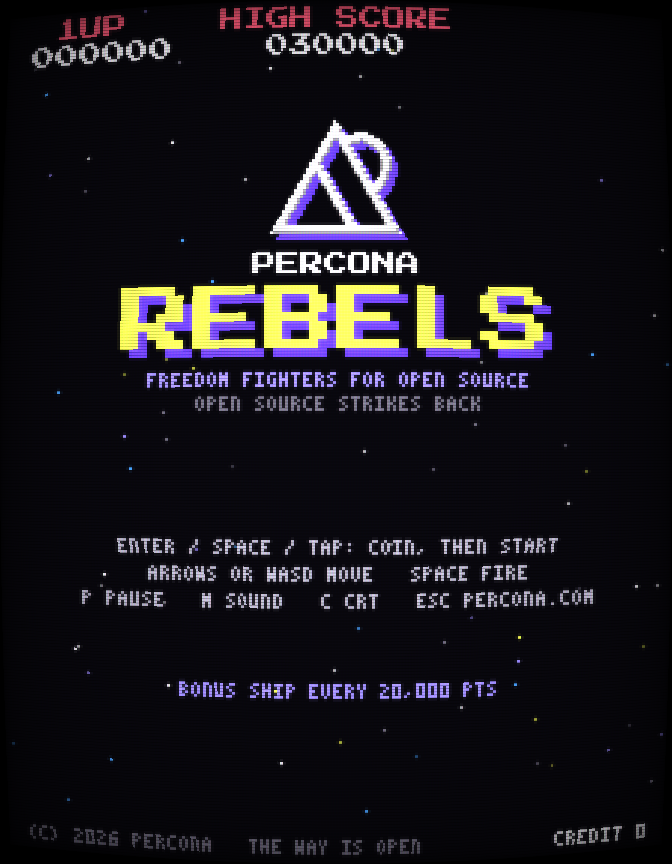
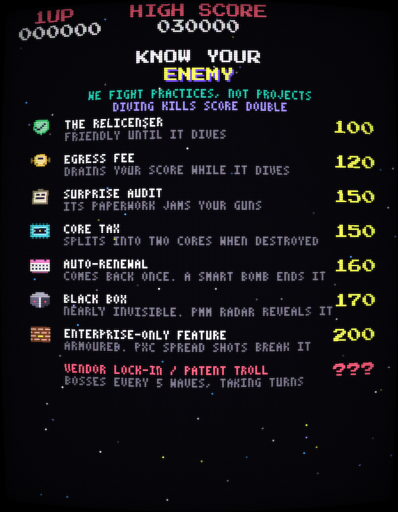
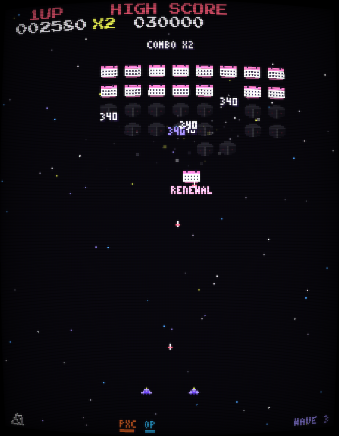
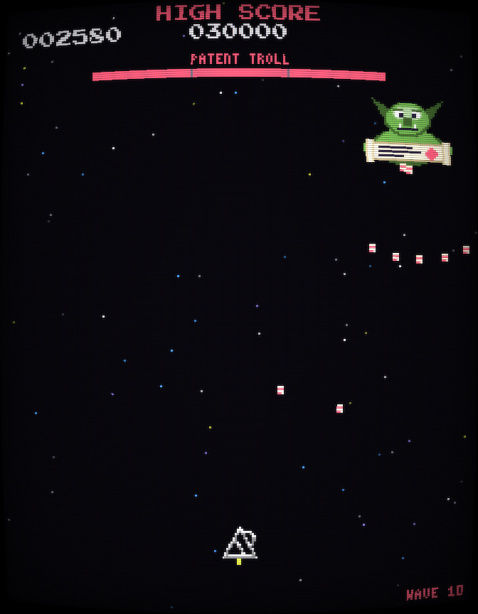

# PERCONA REBELS

**Freedom fighters for open source.** A free 1980s-style arcade shooter from [Percona](https://www.percona.com):
the practices that hold your data hostage fly in formation, dive-bomb you and shoot back. You're the rebel. Open source
strikes back.

**▶ Play it: https://percona-lab.github.io/percona-rebels/**

It's one HTML page and one script: plain canvas at 224×288 (Galaga's own resolution) scaled up in whole pixels, a 60 fps
fixed timestep, and Web Audio for every sound effect and the chiptune loop. No framework, no build step, no tracking.
The only network call is the world high-score table (below). Clone it and open `index.html`, or serve the folder from
anywhere.

## Controls

| | Keyboard | Gamepad | Touch |
|---|---|---|---|
| Insert coin, then start | `Enter` or `Space` (twice) · `5` coin, `1` start | Start | tap (twice) |
| Move | arrow keys or `WASD` | left stick or d-pad | drag anywhere |
| Fire | `Space` (hold for auto) | A / X / RB / RT | automatic |
| Pause / resume | `P` or `Esc` | Start or Back | `II` button |
| Sound on/off | `M` (sound stays off until your first key press) | | `♪` button |
| CRT filter on/off | `C` | | |
| Go to percona.com | the `◀ PERCONA.COM` link, shown while paused | | same |

Leaving mid-game doesn't lose your run: following the link, refreshing or closing the tab saves it in your browser,
and your next visit (within a day) picks it up again, paused.

## Know your enemy

We fight practices, not projects. No company, product or open source project is an enemy here.

| Enemy | What it does |
|---|---|
| The Relicenser | friendly in formation, turns hostile the moment it dives |
| Egress Fee | drains your score while it dives |
| Surprise Audit | its paperwork doesn't kill you, it jams your guns |
| Core Tax | splits into two cores when destroyed |
| Auto-Renewal | comes back once after you destroy it; a smart bomb ends it for good |
| Black Box | nearly invisible until PMM radar is on |
| Enterprise-Only Feature | armoured; PXC spread shots and wingmen break through |

Every fifth wave a boss turns up, taking turns: **Vendor Lock-In**, a padlock battleship, and the **Patent Troll**, who
owns the concept of rows.

## Power-ups

Percona tools drop as you break free:

| Drop | Effect |
|---|---|
| PMM | radar: every dive is announced, with its flight path, before it starts |
| XtraBackup | a shield that absorbs one hit; grab another while shielded for an extra life |
| Percona Operator | two wingman drones |
| PXC | three-node spread shot |
| Percona Toolkit | `pt-kill` smart bomb: hits everything on screen |

Classic rules: 3 lives, a bonus ship every 20,000 points, kills while an enemy dives score double, a combo multiplier up
to ×8, a no-hit bonus per wave, and initials entry for the high-score tables. `prefers-reduced-motion` cuts the screen
shake, flashes and warp streaks.

## World high scores

Everyone playing on GitHub Pages shares one **WORLD TOP 10**. It lives in a Google Sheet behind a small Google Apps
Script web app, [`leaderboard/Code.gs`](leaderboard/Code.gs). Every game gets a one-time ticket when it starts and
the script times the run itself, so a score can't claim more play time than really passed. The numbers have to fit
the game's rules, and very big scores wait for a human to check them before they show up.

Yes, you can read the code and, with enough patience, fool it. It's a game about open source: have fun with the code,
but faked scores get removed.

* **What's sent:** your three initials, score, wave, seconds played and kill count, and only when you enter initials after
  a game. Nothing else: no names, no ids, and Apps Script never sees your IP address.
* **Your own table** stays in your browser's `localStorage`, and the game falls back to it if the world table can't be
  reached.
* **Running your own copy:** set up the script with [`leaderboard/SETUP.md`](leaderboard/SETUP.md) and put its URL in
  `window.REBELS_LEADERBOARD` in `index.html`, or remove that line to play offline only.

## Changing the game

Everything you're likely to tweak is at the top of `rebels.js`:

* `ENEMIES`: name, label, colour, hits, points, dive pattern (`swoop`, `dive`, `zigzag`, `loop`, `spiral`), sprite, an
  optional ability (`flip`, `drain`, `jam`, `split`, `renew`, `stealth`, `armor`) and the wave-card quip. Waves bring
  them in two at a time, in list order.
* `BOSSES`: the two bosses and their banner lines; they take turns.
* `POWERUPS` and `RULES`: durations, drop rates, lives, bonus-ship threshold, boss frequency, combo.

Keep it about practices, and keep the quips playful, never insulting.

The script also has an optional "choose your pilot" mode that Percona uses internally with its staff directory. It's
off here: no directory data is part of this repository.

## License and trademarks

* The code (`index.html`, `rebels.js`) is released under the [MIT License](LICENSE).
* The fonts Press Start 2P and VT323 are licensed under the [SIL Open Font License 1.1](OFL.txt).
* "Percona", the Percona logo (the mountain mark the player's ship is drawn from) and the Percona product icons (PMM,
  Percona Operators, Percona for MySQL) are trademarks of Percona LLC. They are **not** covered by the MIT License; see
  [LICENSE](LICENSE).
* All enemy and boss art is original. No third-party logos or trademarks are used.
* `leaderboard/Code.gs` is part of the code and also MIT licensed.
